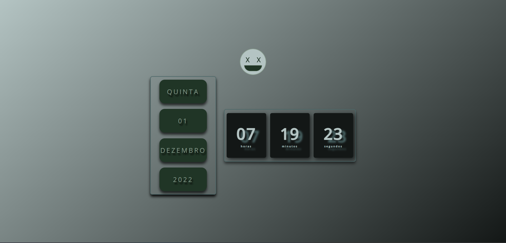

<h1 align="center"> Relogio-JS </h1>

    Projeto desenvolvidor por willanglitch utilizando o objeto new Date do javascript .

  <a href="#-tecnologias">Tecnologias</a>&nbsp;&nbsp;&nbsp;|&nbsp;&nbsp;&nbsp;
  <a href="#-projeto">Projeto</a>&nbsp;&nbsp;&nbsp;|&nbsp;&nbsp;&nbsp;
  <a href="#memo-licença">Licença</a>

  

 

  

 

## 🚀 Tecnologias

Esse projeto foi desenvolvido com as seguintes tecnologias:

- HTML
- CSS
- JavaScript
- Git e GitHub

 

## 💻 Projeto

 O relogio js é uma aplicação que visa usar e manipular elementos através do javascript !!.

[🔗 Acesse aqui](https://willianglitch.github.io/Relogio-JS/)

 

<!-- ## 🔖 Layout

Você pode visualizar o layout do projeto através [desse link](<#>). É necessário ter conta no [Figma](https://figma.com) para acessá-lo. -->

 

## :memo: Licença

Esse projeto está sob a licença MIT.

---

Feito by willianglitch :wave: [LinkedIn](https://www.linkedin.com/in/willianglitchprogramador/)
